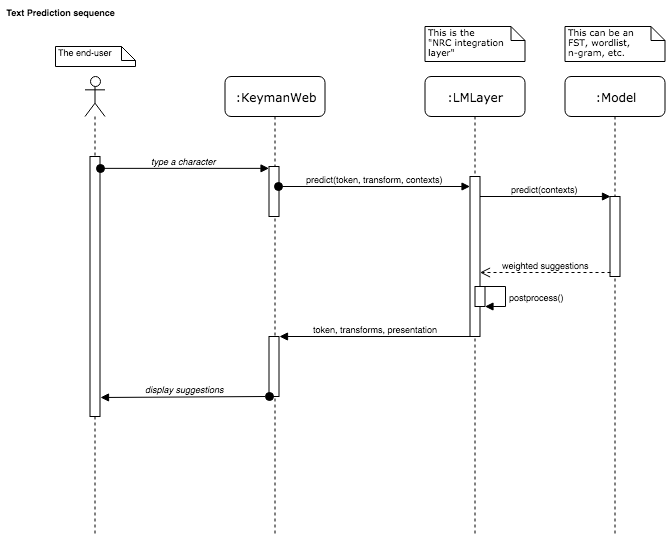

Keyman LMLayer prototype
========================

Prototype of NRC language model layer for Keyman.

I'm developing and experimenting with the API and how different API
designs will practically work.


Communication protocol between keyboard and asynchronous worker
---------------------------------------------------------------



We have decided that everything to the right of the `KeymanWeb` will be in a
Web Worker. However, communication can happen only through
[`postMessage(data)`][postMessage] commands,
where `data` is a serializable object (via the [structured clone][]
algorithm).

What serializable object can we send that will adhere to the [open-closed principle]?

### Messages

The idea is to use a [discriminated union][]. The protocol involves
plain JavaScript objects with one property called `message` that takes
a finite set of `string` values.

These string values indicate what message should be sent. The rest of
the properties in the object are the parameters send with the message.

```javascript
{
    message: 'predict',
    // message-specific properties here
}
```

See also: [XML-RPC][]

Messages are **not** methods. That is, there is no assumption that
a client will receive a reply when a message is sent. However, some
pairs of messages, such as `predict` and `suggestions`, lightly assume
request/response semantics.

[discriminated union]: http://www.typescriptlang.org/docs/handbook/advanced-types.html#discriminated-unions
[open-closed principle]: https://en.wikipedia.org/wiki/Open%E2%80%93closed_principle
[XML-RPC]: https://en.wikipedia.org/wiki/XML-RPC
[structured clone]: https://developer.mozilla.org/en-US/docs/Web/API/Web_Workers_API/Structured_clone_algorithm
[postMessage]: https://developer.mozilla.org/en-US/docs/Web/API/Worker/postMessage


### Tokens

Tokens uniquely identify an input event, such as a keypress. Since
Keyman should ask for an asynchronous prediction on most keypresses, the
token is intended to associate a prediction and its response with
a particular input; Keyman is free to ignore prediction responses if
they are for outdated input events.

The `Token` type is opaque to LMLayer. That is, LMLayer does not inspect
its contents; it simply uses it to identify a request and pass it back
to Keyman. There are a few requirements on the concrete type of the
`Token`:

 1. Tokens MUST be serializable via the [structured clone][] algorithm;
 2. Tokens MUST be usable as a key in a [`Map`][Map object] object.
 3. Tokens MUST be unique across messages. That is, tokens MUST NOT be
    duplicated for between different messages.

It is up to Keyman to create unambiguous tokens that can be uniquely
identified through the round-trip process.

In the following examples, I'll use the subset of `number` values that
are interpretable as [31-bit signed integers][Smi].

[Map object]: https://developer.mozilla.org/en-US/docs/Web/JavaScript/Reference/Global_Objects/Map#Key_equality
[Smi]: https://github.com/thlorenz/v8-perf/blob/master/data-types.md#efficiently-representing-values-and-tagging


### Example

An asynchronous message to predict after typing 'D':

```javascript
{
    message: 'predict',

    token: 1,
    transform: {
        insert: 'D',
        deleteLeft: 0,
        deleteRight: 0
    },
    contexts: [
        // TO BE DETERMINED
    ]
}
```

Message types
-------------

Currently there are four message types:

Message       | Direction          | Parameters          | Expected reply      | Uses token
--------------|--------------------|---------------------|---------------------|---------------
`initialize`  | keyboard → LMLayer | initialization      | Yes — `ready`       | No
`ready`       | LMLayer → keyboard | configuration       | No                  | No
`predict`     | keyboard → LMLayer | transform, contexts | Yes — `suggestions` | Yes
`suggestions` | LMLayer → keyboard | suggestions         | No                  | Yes


### Message: `initialize`

Must be sent from the keyboard to the LMLayer so that the LMLayer
initializes a model. It will send `initialization` which is a plain
JavaScript object specify the path to the model, as well configurations
and platform restrictions.

The keyboard **MUST NOT** send any messages to the LMLayer prior to
sending `initialize`. The keyboard **SHOULD** wait until receiving the
`ready` message from the LMLayer before sending another message.

These are the configurations, and platform restrictions sent to
initialize the LMLayer and its model.

```javascript
let initialization = {
  /**
   * [REQUIRED]
   * Path to the model. There are no concrete restrictions on the path
   * to the model, so long as the LMLayer can succesfully use it to
   * initialize the model.
   *
   * type: string
   */
   model: './models/en_CA-x-testing',

  /**
   * Whether the platform supports right contexts.
   * The absense of this rule implies false.
   *
   * type: bool
   */
  supportsRightContexts: false,

  /**
   * Whether the platform supports deleting to the right.
   * The absence of this rule implies false.
   *
   * type: bool
   */
  supportsDeleteRight: false,

  /**
   * [REQUIRED]
   * The maximum amount of code units that the keyboard will provide to
   * the left of the cursor.
   *
   * type: number
   */
  maxLeftContextCodeUnits: 32,

  /**
   * The maximum amount of code units that the keyboard will provide to
   * the right of the cursor.
   * The absence of this rule implies 0. See also,
   * supportsRightContexts.
   *
   * type: number
   */
  maxRightContextCodeUnits: 32,
};
```


### Message: `ready`

Must be sent from the LMLayer to the keyboard when the LMLayer's model
is finished initializing. It will send `configuration`, which is
a plain JavaScript object requesting configuration from the keyboard.

There are only two options defined so far:

```javascript
let configuration = {
    /**
     * How many UTF-16 code units maximum to send as the context to the
     * left of the cursor ("left" in the Unicode character stream).
     *
     * Affects the `context` property sent in `predict` messages.
     *
     * TODO: Will this ever bisect graphical cluster boundaries?
     */
    leftContextCodeUnits: 32,

    /**
     * How many UTF-16 code units maximum to send as the context to the
     * right of the cursor ("right" in the Unicode character stream).
     *
     * Affects the `context` property sent in `predict` messages.
     *
     * TODO: Will this ever bisect graphical cluster boundaries?
     */
    rightContextCodeUnits: 32,
};
```


### Message: `predict`

...


### Message: `suggestions`

...


TODO
====

 - [ ] make simple `index.html` that demos a dummy model
 - [ ] enable continuous integration
 - [ ] TypeScript!
 - [ ] Figure out what a `Context` will be
 - [ ] make TinyWorker's `self` inherit from the global scope?
 - [ ] Refactor `LMLayer` with state pattern?
