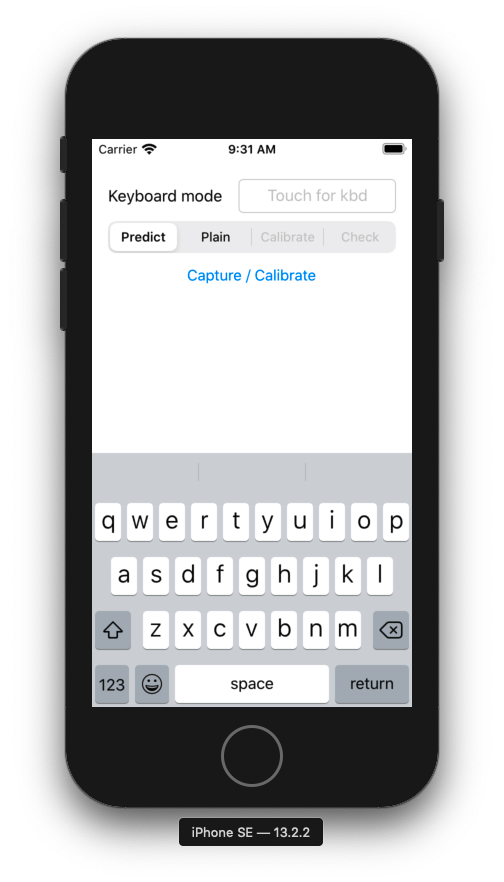
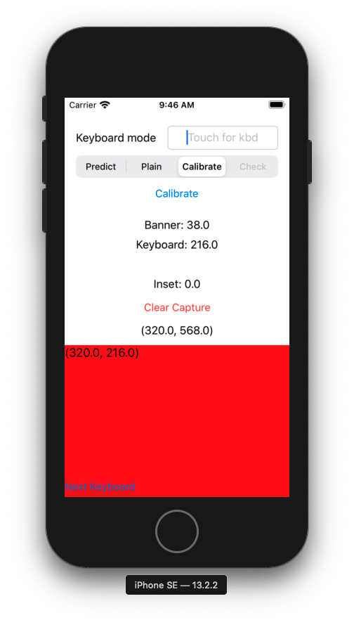
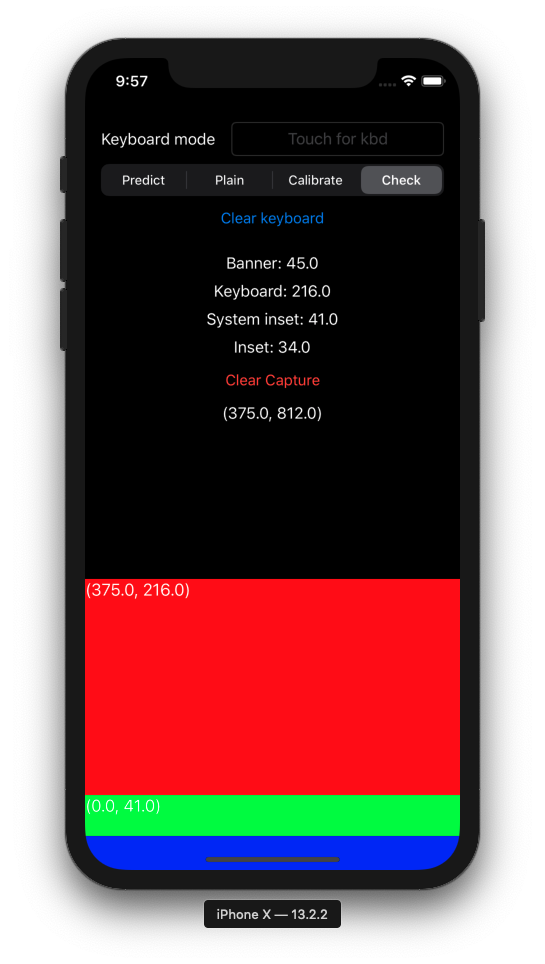

#  The Keyboard Calibrator

This tool was designed to facilitate collection of values for use with `KeymanEngine`'s `KeyboardScaleMap` class.  By taking various readings in sequence, this app able to cailbrate a dummy "calibration keyboard" to the exact dimensions of the default system keyboard and report those values for external use.

## Usage

1.  As is standard for iOS system keyboards, be sure to visit **Settings > General > Keyboard > Keyboards > Add New Keyboard...** and enable **Keyboard Calibrator** as a system-level keyboard.  This is necessary for the in-app "Calibrate" step to work correctly.
2.  Return to the app and click the text input box.
    - If the keyboard does not appear in the Simulator, use the macOS Simulator menu's **Hardware > Keyboard > Connect Hardware Keyboard** option (Shift-Cmd-K) until it does.
3.  In sequence, click the text input box and then the **Capture** button on both the _Predict_ and _Plain_ settings.
    - The app will automatically advance to the next setting after each "capture".

4.  For the _Calibrate_ setting, once the keyboard appears, swap it to the Calibration keyboard provided by the app.  You should then see something like the following:

5.  Note that the height displayed by the keyboard should match the value displayed beside "Keyboard: " within the app.  If so, click **Calibrate**.
    - If not, something's broken... likely with the App Group permissions necessary to forward the calibration value from the app to the keyboard.
6.  New values should appear, and the keyboard height value may have been adjusted.  Calibration is now complete; the _Check_ setting will allow you to display the calibration keyboard in-app and examine how each component of the calculation lines up against the default system keyboard.
    - You may want to revisit a previous setting and set it back to the default system keyboard for comparison; _Check_ will only ever display the calibration keyboard, so this will allow for easier visual confirmation.
    

7.  Repeat steps 2 through 6 for the other device orientation.

## Notes

On tablet devices, the default "banner" may not disappear when prediction is turned off for an input.  In this case, the banner's height will generally be reported as the "system inset" instead.  Said "System inset" (on phones) corresponds to the part of the iOS phone keyboard that never disappears on iPhone X and later devices _below_ the keyboard.

Note that the green and blue components that display in-app for _Check_ will never display within the system keyboard.  These refer to regions not available to the Keyman keyboard that resulted in the final calibrated height reported by the app.
- Blue:  refers to "safe area insets" due to device screen curvature
- Green:  refers to the additional area consumed by the menu providing the keyboard menu and dictation keys on iPhone X and later phone form-factor devices.
